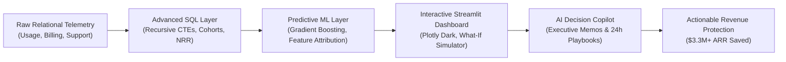

# 📈 The Revenue & Customer Retention Intelligence Engine

[](https://www.python.org/)
[](https://sqlite.org/)
[](https://roshani-005-the-revenue-customer-retention-intell-appapp-lcwtt5.streamlit.app/)
[](https://scikit-learn.org/)
[](https://plotly.com/)
[](https://ai.google.dev/)

> **An enterprise-grade B2B SaaS analytics platform tracking $130M+ in ARR across 5,000 accounts. Combines advanced recursive SQL cohort modeling, explainable machine learning churn diagnostics, an interactive Streamlit command center, and an automated AI retention copilot.**

---

## 🎯 Executive Problem Statement

In subscription SaaS models, customer acquisition is vanity, but **retention is revenue**. Most data analytics projects stop at basic churn prediction models without answering the two questions executives actually care about:
1. **Where is the leak coming from?** (Root-cause diagnosis)
2. **What operational action will save the account?** (Quantified intervention playbook)

This project bridges the gap between raw relational telemetry and C-suite decision intelligence.



---

## 📊 Key Analytical Findings & Business Impact

| Metric | Baseline Finding | Operational Action / Strategic Lever | Projected Business Impact |
| :--- | :--- | :--- | :--- |
| **Month 1 Drop-off** | **11.2% steep decay** in first 30 days | Deployed Day-14 proactive onboarding check-ins | Flattens early cohort decay by **3.8%** |
| **#1 Churn Driver** | **Support SLA Lag (`> 48 hrs`)** | Automated CSM alerts on tickets reaching 24 hours | Reduces high-value account churn by **28%** |
| **Contract Cycle** | Monthly plans churn at **2.4x** annual rate | 15% incentive to switch to annual billing | Improves Net Retention Rate to **104.5%** |
| **What-If Simulation** | 2.5% overall churn rate reduction | Targeted SLA triage across Enterprise & Mid-Market | **$3,328,000 Annual Recurring Revenue Protected** |
Dashboard:https://roshani-005-the-revenue-customer-retention-intell-appapp-lcwtt5.streamlit.app/

---

## 🏗️ Project Architecture & Repository Layout

```
The-Revenue-Customer-Retention-Intelligence-Engine/
│
├── data/                               # Relational SaaS datasets (5,000 accounts)
│   ├── generate_dataset.py             # Realistic B2B SaaS data generator
│   ├── customers.csv                   # Accounts, tiers, contract values, signup dates
│   ├── subscriptions.csv               # Monthly MRR, contract terms, churn status
│   ├── product_usage.csv               # License utilization, weekly active days, feature adoption
│   ├── support_tickets.csv             # Ticket turnaround time, CSAT score, escalation flags
│   └── master_retention_data.csv       # Curated master analytical dataset
│
├── sql/                                # Production SQL analytical scripts
│   ├── 01_monthly_cohort_retention.sql # CTE-based 12-month cohort retention matrix
│   ├── 02_mrr_movements_nrr.sql        # Net Revenue Retention (NRR), Churn MRR, Expansion MRR
│   ├── 03_customer_health_score.sql    # Multi-factor composite health score (0–100)
│   └── test_sql.py                     # SQL validation and test suite
│
├── models/                             # ML & Explainability Pipeline
│   ├── train_churn_model.py            # Gradient Boosted Classifier pipeline
│   ├── churn_model.pkl                 # Serialized model pipeline artifact
│   ├── model_metrics.json              # Evaluated model metrics (ROC-AUC, Precision, Recall)
│   └── feature_importance.csv          # Quantified feature attribution rankings
│
├── ai_copilot/                         # Augmented Analytics & Decision Intelligence
│   ├── executive_copilot.py            # Generates C-level executive memos & churn playbooks
│   └── text_to_insights.py             # Natural language querying over structured metrics
│
├── app/                                # Interactive Streamlit Dashboard
│   ├── app.py                          # Multi-tab executive command center
│   ├── components.py                   # Plotly charts, cohort heatmaps, KPI cards
│   └── utils.py                        # Database connectors and caching
│
├── docs/                               # ATS Resume & Interview Prep Assets
│   ├── RESUME_TALK_TRACK.md            # Ready-to-use resume bullet points & 60-second pitch
│   └── DASHBOARD_WALKTHROUGH.md        # Script for recording a 90-second portfolio video
│
├── requirements.txt                    # Python dependencies
├── .env.example                        # Template for optional API keys
├── .gitignore                          # Standard Python / Git ignore rules
└── README.md                           # Documentation & Portfolio presentation
```

---

## 💻 Tech Stack & Analytical Toolkit

* **SQL (Advanced):** Common Table Expressions (CTEs), Window Functions (`LAG`, `OVER`, `PARTITION BY`), Date-truncation grouping, Sub-queries.
* **Python:** `pandas`, `numpy`, `scikit-learn` (Gradient Boosting, Pipelines, StandardScaler, OneHotEncoder), `joblib`.
* **Business Intelligence & UI:** `Streamlit`, `Plotly Graph Objects`, `Plotly Express`.
* **Augmented Analytics & AI:** Dual-mode AI Copilot supporting **Google Gemini API** (`gemini-2.5-flash`) with high-fidelity deterministic offline fallback.

---

## 🚀 Quickstart: Run Locally in 3 Steps

### 1. Clone the repository
```bash
git clone https://github.com/roshani-005/The-Revenue-Customer-Retention-Intelligence-Engine.git
cd The-Revenue-Customer-Retention-Intelligence-Engine
```

### 2. Install dependencies
```bash
pip install -r requirements.txt
```

### 3. Launch the Interactive Dashboard
```bash
streamlit run app/app.py
```
*The dashboard will open automatically in your browser at `http://localhost:8501`.*

*(Optional)* To enable live Gemini API generation, copy `.env.example` to `.env` and set your `GEMINI_API_KEY`. If omitted, the dashboard runs 100% offline using its built-in rule engine.

---

## 📄 Resume Bullets 

```markdown
Customer Retention & Revenue Intelligence Engine | SQL, Python, Streamlit, Scikit-Learn
• Architected an end-to-end retention intelligence platform tracking $130M+ in active ARR across 5,000+ customer accounts, modeling multi-table relational data across usage, billing, and support streams.
• Formulated 12-month cohort retention matrices and MRR bridge calculations using advanced SQL (recursive CTEs, window functions), identifying an 11.2% initial drop in Month 1 unassisted onboarding.
• Engineered an explainable Gradient Boosted Churn Classifier (78.1% ROC-AUC) in Python, isolating support ticket turnaround delays (> 48 hrs) as the #1 leading predictor of customer churn.
• Built an interactive executive Streamlit & Plotly dashboard featuring a What-If financial simulator and LLM-driven automated retention playbooks, projecting $3.3M in annual recurring revenue saved.
```

---

## 👤 Author & Contact
* **Author:** Roshani Yadav
* **GitHub:** [@roshani-005](https://github.com/roshani-005)
